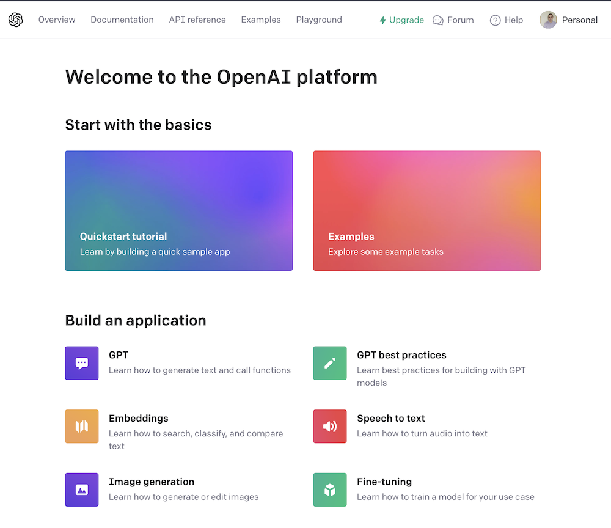
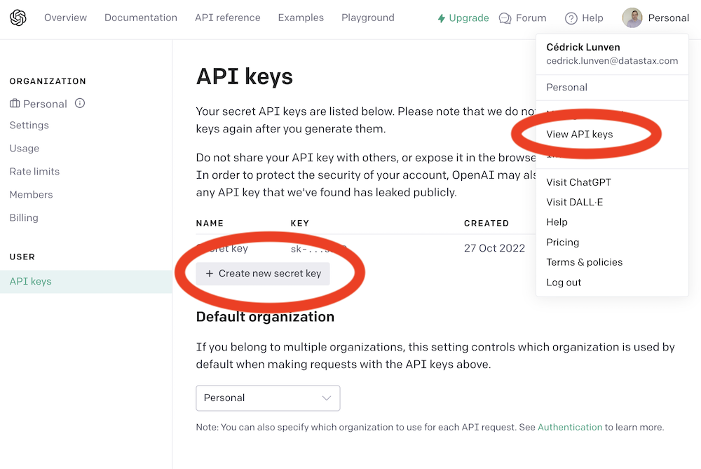

# Demo of Generative AI with Java

[](https://gitpod.io/#https://github.com/datastaxdevs/demo-generativeai-with-java)
[](http://www.apache.org/licenses/LICENSE-2.0)
[](https://discord.com/widget?id=685554030159593522&theme=dark)

## 📋 Table of content

- [01. Create Astra Account](#-1---create-your-datastax-astra-account)
- [02. Create Astra Token](#-2---create-an-astra-token)
- [03. Copy the token](#-3---copy-the-token-value-in-your-clipboard)
- [04. Open Gitpod](#-4---open-gitpod)
- [05. Setup CLI](#-5---set-up-the-cli-with-your-token)
- [06. Create Database](#-6---create-destination-database-and-a-keyspace)
- [07. Setup env variables](#-7---setup-env-variables)
- [08. Register to OpenAI](#-8---register-to-openai)
- [09. Setup Project](#-9---setup-project)

----
## HouseKeeping

### Objectives

* Introduce AstraDB and Vector Search capability
* Provide you a working Generative AI demo

### Frequently asked questions

<p/>
<details>
<summary><b> 1️⃣ Can I run this workshop on my computer?</b></summary>
<hr>
<p>There is nothing preventing you from running the workshop on your own machine, If you do so, you will need the following
<ol>
<li><b>git</b> installed on your local system
<li><b>Java</b> installed on your local system
<li><b>Maven</b> installed on your local system
</ol>
</p>
In this readme, we try to provide instructions for local development as well - but keep in mind that the main focus is development on Gitpod, hence <strong>We can't guarantee live support</strong> about local development in order to keep on track with the schedule. However, we will do our best to give you the info you need to succeed.
</details>
<p/>
<details>
<summary><b> 2️⃣ What other prerequisites are required?</b></summary>
<hr>
<ul>
<li>You will need an enough *real estate* on screen, we will ask you to open a few windows and it does not file mobiles (tablets should be OK)
<li>You will need a GitHub account eventually a google account for the Google Authentication (optional)
<li>You will need an Astra account: don't worry, we'll work through that in the following
<li>As Intermediate level we expect you to know what java and maven are
</ul>
</p>
</details>
<p/>
<details>
<summary><b> 3️⃣ Do I need to pay for anything for this workshop?</b></summary>
<hr>
<b>No.</b> All tools and services we provide here are FREE. FREE not only during the session but also after.
</details>
<p/>
<details>
<summary><b> 4️⃣ Will I get a certificate if I attend this workshop?</b></summary>
<hr>
Attending the session is not enough. You need to complete the homeworks detailed below and you will get a nice badge that you can share on linkedin or anywhere else *(open api badge)*
</details>
<p/>

### Materials for the Session

It doesn't matter if you join our workshop live or you prefer to work at your own pace,
we have you covered. In this repository, you'll find everything you need for this workshop:

- [Slide deck](/slides/slides.pdf)
- [Discord chat](https://dtsx.io/discord)

----

## LAB

#### ✅ `1` - Create your DataStax Astra account

> ℹ️ Account creation tutorial is available in [awesome astra](https://awesome-astra.github.io/docs/pages/astra/create-account/)


_click the image below or go to [https://astra.datastax./com](bit.ly/3QxhO6t)_

<a href="bit.ly/3QxhO6t">

</a>
<br/>


#### ✅ `2` - Create an Astra Token

> ℹ️ Token creation tutorial is available in [awesome astra](https://awesome-astra.github.io/docs/pages/astra/create-token/#c-procedure)

- `Locate `Settings` (#1) in the menu on the left, then `Token Management` (#2)

- Select the role `Organization Administrator` before clicking `[Generate Token]`


The Token is in fact three separate strings: a `Client ID`, a `Client Secret` and the `token` proper. You will need some of these strings to access the database, depending on the type of access you plan. Although the Client ID, strictly speaking, is not a secret, you should regard this whole object as a secret and make sure not to share it inadvertently (e.g. committing it to a Git repository) as it grants access to your databases.

```json
{
  "ClientId": "ROkiiDZdvPOvHRSgoZtyAapp",
  "ClientSecret": "fakedfaked",
  "Token":"AstraCS:fake"
}
```

#### ✅ `3` - Copy the token value in your clipboard

You can also leave the windo open to copy the value in a second.

#### ✅ `4` - Open Gitpod

>
> ↗️ _Right Click and select open as a new Tab..._
>
> [](https://gitpod.io/#https://github.com/datastaxdevs/https://gitpod.io/#https://github.com/datastaxdevs/demo-generativeai-with-java)
>


#### ✅ `5` - Set up the CLI with your token

_In gitpod, in a terminal window:_

- Login

```bash
astra login --token AstraCS:fake
```

- Validate your are setup

```bash
astra org
```

> **Output**
> ```
> gitpod /workspace/workshop-beam (main) $ astra org
> +----------------+-----------------------------------------+
> | Attribute      | Value                                   |
> +----------------+-----------------------------------------+
> | Name           | cedrick.lunven@datastax.com             |
> | id             | f9460f14-9879-4ebe-83f2-48d3f3dce13c    |
> +----------------+-----------------------------------------+
> ```


#### ✅ `6` - Create destination Database and a keyspace

> ℹ️ You can notice we enabled the Vector Search capability

- Create db `workshop_beam` and wait for the DB to become active

```
astra db create demo-genai -k genai --vector --if-not-exists
```

> 💻 Output
>
> ```console
> [INFO]  Database 'demo-genai' does not exist. Creating database 'demo-genai' with keyspace 'genai'
> [INFO]  Enabling vector search for database demo-genai
> [INFO]  Database 'demo-genai' and keyspace 'genai' are being created.
> [INFO]  Database 'demo-genai' has status 'PENDING' waiting to be 'ACTIVE' ...
> [INFO]  Database 'demo-genai' has status 'ACTIVE' (took 112341 millis)
> [OK]    Database 'demo-genai' is ready.
> ```

- List databases

```
astra db list
```

> 💻 Output
>
> ```
> +--------------------------+--------------------------------------+-----------+-------+---+-----------+
> | Name                     | id                                   | Regions   | Cloud | V | Status    |
> +--------------------------+--------------------------------------+-----------+-------+---+-----------+
> | demo-genai               | 9e54ff00-57e2-47ed-8699-f94d5dd11b6f | us-east1  | gcp   | ■ | ACTIVE    |
> +--------------------------+--------------------------------------+-----------+-------+---+-----------+
> ```

- Describe your db

```
astra db describe demo-genai
```

> 💻 Output
> 
> ```console
> +------------------+-----------------------------------------+
> | Attribute        | Value                                   |
> +------------------+-----------------------------------------+
> | Name             | demo-genai                              |
> | id               | 9e54ff00-57e2-47ed-8699-f94d5dd11b6f    |
> | Status           | ACTIVE                                  |
> | Cloud            | GCP                                     |
> | Regions          | us-east1                                |
> | Default Keyspace | genai                                   |
> | Creation Time    | 2023-09-12T08:55:36Z                    |
> |                  |                                         |
> | Keyspaces        | [0] genai                               |
> |                  |                                         |
> |                  |                                         |
> | Regions          | [0] us-east1                            |
> |                  |                                         |
> +------------------+-----------------------------------------+
> ```


#### ✅ `7` - Setup env variables

- Create `.env` file with variables

```bash
astra db create-dotenv genai 
```

- Display the file

```bash
cat .env
```

- Load env variables

```
set -a
source .env
set +a
env | grep ASTRA
```

#### ✅ `8` - Register to OpenAI

- Access to [OpenAI platform](https://platform.openai.com/) and register.



- In your profile, go to `View API KEYS`, create a new key and copy the value in your clipboard. 
You have a free trial for a month of so.



```java
EXPORT OPENAI_API_KEY=<key>
```

#### ✅ `9` - Setup project

This command will allows to validate that Java , maven and lombok are working as expected

> Note:
> To create the project i simply when with the astra sdk arachetype as follow
> ```
> mvn archetype:generate \
> -DarchetypeGroupId=com.datastax.astra \
> -DarchetypeArtifactId=spring-boot-3x-archetype \
> -DarchetypeVersion=0.6.9 \
> -DinteractiveMode=false \
> -DgroupId=fr.clunven \
> -DartifactId=genai-demo \
> -Dversion=1.0-SNAPSHOT
> ```
> and added the vector dependency:
> ```xml
> <dependency>
>  <groupId>com.datastax.astra</groupId>
> ```

```
mvn clean compile
```


